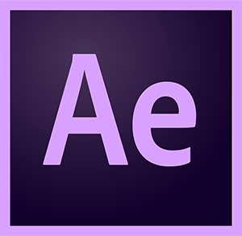

I'm Chirag, a self-motivated researcher and open source contributer.

<h4 align="center">
💻 ML, NLP, full stack developer in R&D <a href="https://amadeus.com/en">@Amadeus</a> | Doing research in ML/DL
</h4>

<a href="http://cgupta.tech/">cgupta.tech</a>
&nbsp;&nbsp;&nbsp;
<a href="http://cgupta.tech/quickdraw.html">CNN demo</a>
&nbsp;&nbsp;&nbsp;
<a href="http://cgupta.tech/RnnTextGenerator.html">RNN demo</a>
&nbsp;&nbsp;&nbsp;
<a href="http://devchirag2796.pythonanywhere.com/">Huddle demo</a>

 

  

<h3 align="center">Skilled in</h2>
 

&nbsp;&nbsp;&nbsp;&nbsp;

&nbsp;&nbsp;&nbsp;&nbsp;

 

### Let's Connect :coffee:
 
 

	
    
	
    
    
	

 
 
<h3 align="center">
My Tech Stack
</h3>

<h3 align="center">

</h3>